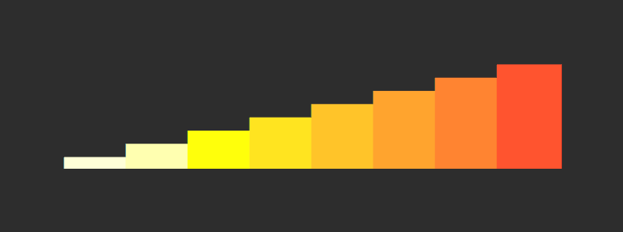

# 

> Generate sparklines `▁▂▃▅▂▇`

JavaScript port of [spark.sh](https://github.com/holman/spark).

[Some cool use-cases.](https://github.com/holman/spark/wiki/Wicked-Cool-Usage)

## Install

```sh
npm install sparkly
```

## Usage

```js
import sparkly from 'sparkly';

sparkly([0, 3, 5, 8, 4, 3, 4, 10]);
//=> '▁▃▄▇▄▃▄█'

// Specifying anything other than finite numbers will cause holes
sparkly([0, 3, 5, '', 4, 3, 4, 10]);
//=> '▁▃▄ ▄▃▄█'

// Specifying minimum and/or maximum options will change the sparkline range
sparkly([1, 2, 3, 4, 5], {minimum: 0, maximum: 10});
//=> '▁▂▃▄▄'

// With only maximum set, minimum defaults to 0 for backwards compatibility
sparkly([10, 20, 30, 40, 50], {maximum: 100});
//=> '▁▂▃▄▄'

// Specifying a style option will change the sparkline color
sparkly([1, 2, 3, 4, 5, 6, 7, 8], {style: 'fire'});
// ↓
```



## API

### sparkly(numbers, options?)

#### numbers

Type: `number[]`

The numbers to create the sparkline from.

#### options

Type: `object`

##### minimum

Type: `number`

Minimum value of the sparkline range.

Values are scaled relative to this baseline. When not specified:
- If `maximum` is set, defaults to `0` (for backwards compatibility)
- Otherwise, defaults to the minimum value in the data

##### maximum

Type: `number`

Maximum value of the sparkline range.

Values are scaled relative to this maximum. When not specified, defaults to the maximum value in the data.

##### style

Type: `string`\
Values: `'fire'`

Apply color styling to the sparklines.

The `'fire'` style uses a gradient from yellow to red. Each bar has a fixed width of one terminal column.

## Related

- [sparkly-cli](https://github.com/sindresorhus/sparkly-cli) - CLI for this package
